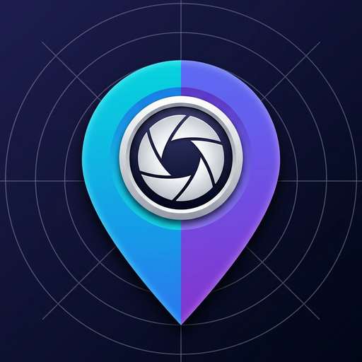
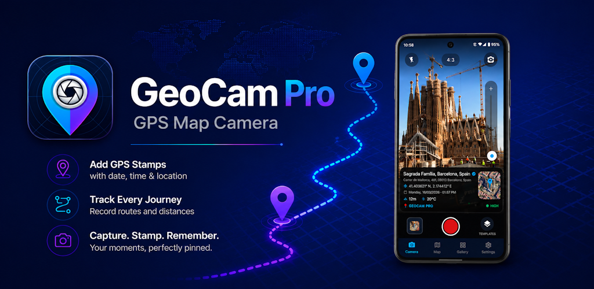
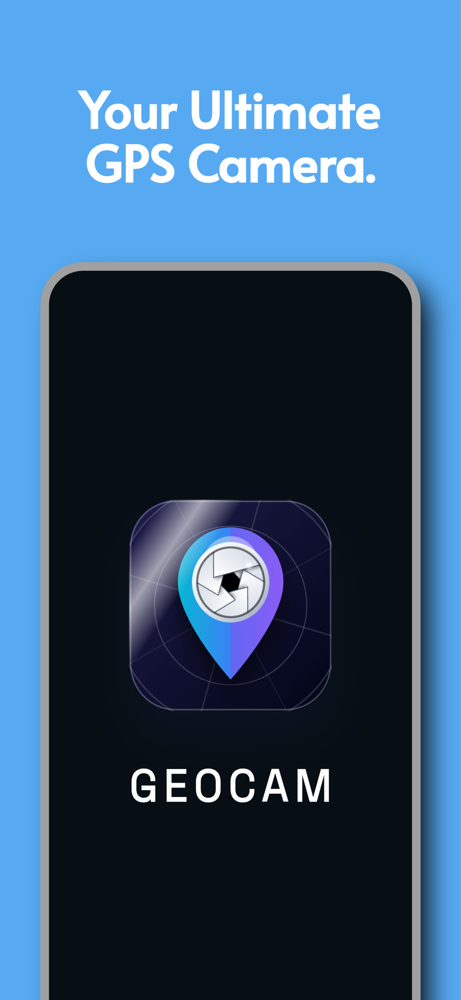
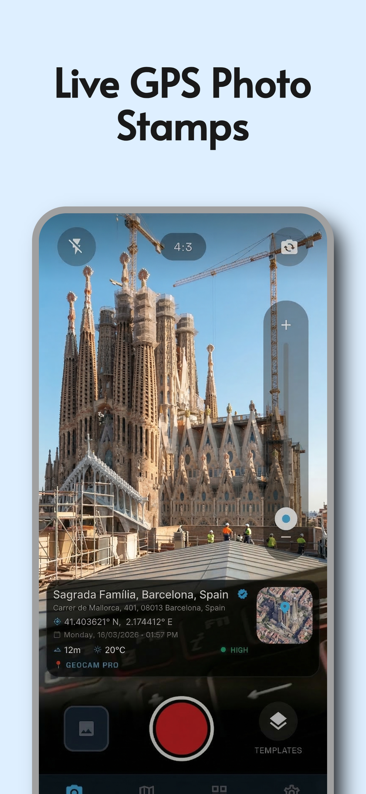
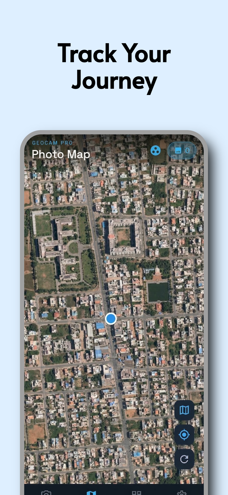
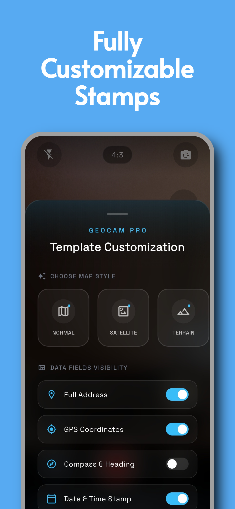
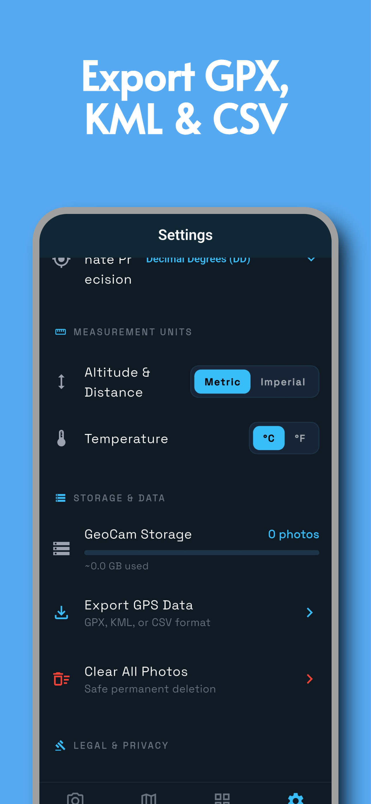
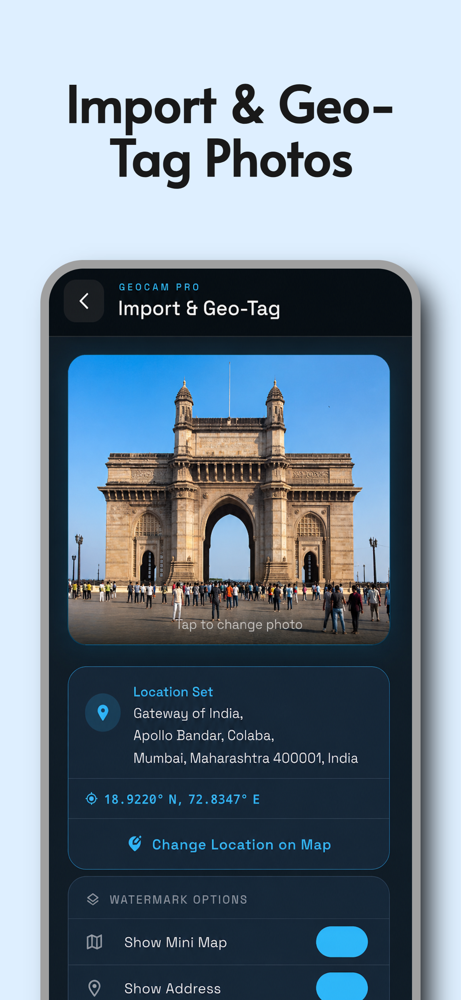

<p align="center">
  
</p>

# <div align="center">📍 GEOCAM PRO</div>

<div align="center">
  <strong>Professional GPS Camera for Site Documentation & Field Reporting</strong>
</div>

<p align="center">
  <a href="https://play.google.com/store/apps/details?id=com.geocam.geocam_flutter">
    
  </a>
</p>

<p align="center">
  
</p>

## 📸 Screenshots

<p align="center">
  
  
  
</p>
<p align="center">
  
  
  
</p>

## 📑 Table of Contents
- [Project Overview](#-project-overview)
- [Problem Statement](#-problem-statement)
- [Solution](#-solution)
- [Tech Stack](#-tech-stack)
- [Architecture](#-architecture)
- [Getting Started](#-getting-started)
- [License](#-license)

## 📋 Project Overview
**GEOCAM PRO** is a feature-rich Flutter application designed for professionals who need accurate, data-rich site documentation. It captures high-quality photos with embedded GPS coordinates, timestamps, weather data, and compass direction, making it the ultimate tool for engineers, surveyors, and field reporters.

## 🎯 Problem Statement
Field professionals often struggle with organizing site photos and ensuring data accuracy:
- Photos lack context (where and when were they taken?)
- Manual data entry for reports is time-consuming and prone to errors
- Existing apps are either too simple or overly expensive
- consolidating scattered media from different sites is a nightmare

## 💡 Solution
**GEOCAM PRO** solves these issues by providing:
- **Automatic Watermarking**: Instantly embeds GPS, date/time, and weather on photos.
- **Project-Based Organization**: photos are sorted by project and location automatically.
- **Map Integration**: View your photo locations on an interactive map.
- **Professional Reports**: Generate PDF reports and customized templates directly from the app.
- **Offline Capable**: Works perfectly in remote areas with poor connectivity.

## 🏗️ Architecture
The project follows a scalable feature-first architecture:

```
lib/
├── models/         # Data models for Projects, Photos, Settings
├── screens/        # UI Screens (Camera, Map, Gallery, Settings)
├── services/       # Core Logic (Camera, Location, Weather, Storage)
├── theme/          # App Styling and Branding
├── widgets/        # Reusable UI Components
└── main.dart       # Application Entry Point
```

## 🛠️ Tech Stack
- **Framework**: Flutter (Dart)
- **Maps**: `flutter_map`, `latlong2`
- **Location**: `geolocator`, `geocoding`
- **Camera**: `camera` package
- **Database**: `sqflite` for local persistent storage
- **Weather API**: Integrated via `http`
- **Ads**: Google Mobile Ads SDK

## 🚀 Getting Started

### Prerequisites
- Flutter SDK 3.0+
- Android Studio / VS Code
- Android SDK 21+

### Installation
```bash
# Clone the repository
git clone https://github.com/Nishanth619/GeoCam-Pro.git

# Navigate to project directory
cd geocam_flutter

# Install dependencies
flutter pub get

# Run the app
flutter run
```

### Environment Setup
If you are using real API keys (e.g. for Weather or Maps), create a `.env` file or configure your `local.properties` as needed (Currently configured for open-source alternatives where possible).

## 📄 License
Copyright (c) 2026 Nishanth619. All Rights Reserved.

This project is proprietary software. Unauthorized copying, modification, distribution, or use of this source code is strictly prohibited.

---
*Built with ❤️ using Flutter*
